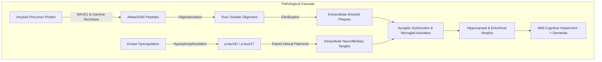
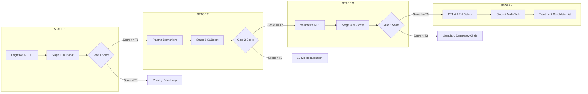
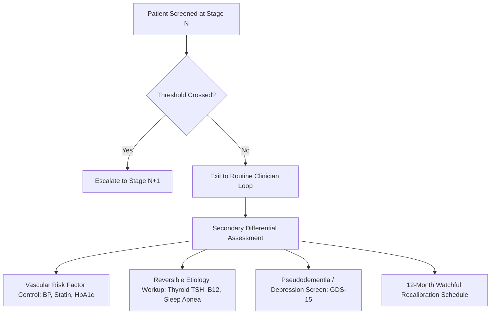

# StepWise: Knowledge Base — Problem Statement & Clinical Neuro-Pathology

> **Document Version:** 1.0.0  
> **Last Updated:** September 2026  
> **Target Platform:** GE Healthcare Precision Care Challenge 2026 (Grand Finale, Bangalore)  
> **Team:** Team Litchi (*Yatharth Gupta, Avyukt Sisodia, Ashish Kumar, Akhshat Sharma*)  
> **Maintainer Protocol:** This is a permanent living document. When updating, **do not purge historical rationale**. Append and refine sections with clear change notes to preserve decision lineages.

---

## Table of Contents
1. [Executive Summary & Problem Statement](#1-executive-summary--problem-statement)
2. [Clinical Grounding: Neurobiology & Pathophysiology of Alzheimer's Disease](#2-clinical-grounding-neurobiology--pathophysiology-of-alzheimers-disease)
   - [The Amyloid Cascade Hypothesis](#the-amyloid-cascade-hypothesis)
   - [Tau Pathology & Neurofibrillary Tangles (NFTs)](#tau-pathology--neurofibrillary-tangles-nfts)
   - [Neuroinflammation, Perivascular Spaces & Vascular Comorbidity](#neuroinflammation-perivascular-spaces--vascular-comorbidity)
   - [Cerebral Amyloid Angiopathy (CAA) & ARIA Risks](#cerebral-amyloid-angiopathy-caa--aria-risks)
3. [The Diagnostic & Therapeutic Paradigm Shift](#3-the-diagnostic--therapeutic-paradigm-shift)
   - [Traditional Symptom-Driven Diagnostic Bottlenecks](#traditional-symptom-driven-diagnostic-bottlenecks)
   - [The Disease-Modifying Therapy (DMT) Revolution](#the-disease-modifying-therapy-dmt-revolution)
   - [Why the Current Pipeline Fails Clinicians and Patients](#why-the-current-pipeline-fails-clinicians-and-patients)
4. [GE Healthcare Strategic Alignment & Technological Context](#4-ge-healthcare-strategic-alignment--technological-context)
   - [GE’s Neuroimaging Portfolio](#ges-neuroimaging-portfolio)
   - [The "Precision Care" Gating Problem](#the-precision-care-gating-problem)
5. [The StepWise Solution: 4-Stage Progressive Clinical Escalation](#5-the-stepwise-solution-4-stage-progressive-clinical-escalation)
   - [Stage 1: Low-Cost Cognitive & Clinical EHR Screening](#stage-1-low-cost-cognitive--clinical-ehr-screening)
   - [Stage 2: Plasma Blood-Based Biomarker Enrichment](#stage-2-plasma-blood-based-biomarker-enrichment)
   - [Stage 3: High-Resolution Volumetric MRI Morphometry](#stage-3-high-resolution-volumetric-mri-morphometry)
   - [Stage 4: Molecular PET Confirmation & ARIA Safety Profiling](#stage-4-molecular-pet-confirmation--aria-safety-profiling)
6. [The "Non-Escalation" Clinician Loop (Managing Screen-Negative Patients)](#6-the-non-escalation-clinician-loop-managing-screen-negative-patients)
7. [Competitive Edge & Hackathon Winning Strategy](#7-competitive-edge--hackathon-winning-strategy)

---

## 1. Executive Summary & Problem Statement

Alzheimer’s Disease (AD) is a progressive, neurodegenerative disorder affecting over 55 million individuals worldwide, with over 8.8 million in India aged 60+ (7.4% prevalence; *LASI-DAD, Lee et al., 2023*). 

### The Core Problem
1. **The Diagnostic Dilemma:** In real-world clinical practice, millions of patients present with mild, non-specific cognitive complaints. Currently, all patients follow an unstratified, sequential diagnostic pathway. This creates severe backlog for specialized diagnostics (PET/MRI), takes 18–24 months on average for a definitive workup, and incurs massive unnecessary financial cost.
2. **The Therapeutic Window:** Novel FDA/EMA-approved anti-amyloid monoclonal antibodies (e.g., Lecanemab/Leqembi, Donanemab/Kisunla) **only benefit patients with Mild Cognitive Impairment (MCI) or early-stage AD with confirmed amyloid pathology**. If diagnosis is delayed until moderate-to-severe neurodegeneration occurs, brain atrophy is irreversible, therapies are clinically ineffective, and insurance reimbursement is denied.
3. **The Challenge Mandate:** Design and build an AI-driven, clinical decision-support system (CDSS) that analyzes multimodal patient data across a **progressive, step-wise escalation framework** (Cognitive $\rightarrow$ Blood $\rightarrow$ MRI $\rightarrow$ PET) to prioritize high-risk patients for early diagnostic intervention while strictly adhering to non-diagnostic decision-support guidelines.

```
                                TRADITIONAL VS. STEPWISE PATHWAY
                                
  Traditional (One-Size-Fits-All):
  [Patient with Concern] ──▶ [MoCA Screen] ──▶ [Routine Labs] ──▶ [Wait 6-12 Mo] ──▶ [MRI / PET] ──▶ [Late Diagnosis]
  (Result: Scanners clogged with low-risk patients; fast-progressors miss treatment window)

  StepWise (Precision Gating):
  [Patient with Concern] ──▶ [Stage 1: Cognitive/EHR] ──(Gate 1)──▶ [Stage 2: Blood Biomarkers]
                                    │                                      │
                               (Below Threshold)                      (Below Threshold)
                                    ▼                                      ▼
                           [Routine Primary Care]                 [12-Month Watchful Recalibration]
                                                                           │ (Above Threshold)
                                                                           ▼
  [Stage 4: PET + ARIA Safety] ◀──(Gate 3)── [Stage 3: Volumetric MRI Morphometry]
```

---

## 2. Clinical Grounding: Neurobiology & Pathophysiology of Alzheimer's Disease

To build clinical trust with neurologists and GE Healthcare adjudicators, the AI decision engine must reflect genuine biological disease staging rather than naive statistical correlations.



### The Amyloid Cascade Hypothesis
* **Amyloid Precursor Protein (APP):** Transmembrane protein integral to neuronal growth and repair.
* **Amyloidogenic Cleavage:** APP is sequentially cleaved by **$\beta$-secretase (BACE1)** and **$\gamma$-secretase** complex (Presenilin-1/2), releasing insoluble $A\beta_{42}$ and $A\beta_{40}$ monomers.
* **Oligomerization & Plaque Formation:** $A\beta_{42}$ monomers aggregate into toxic soluble oligomers (which disrupt synaptic plasticity) and subsequently deposit into extracellular senile plaques.
* **Biomarker Dynamics:** As $A\beta_{42}$ deposits into brain parenchyma, soluble plasma and CSF $A\beta_{42}$ concentrations decrease, making the **plasma $A\beta_{42}/A\beta_{40}$ ratio** a sensitive early biological signal.

### Tau Pathology & Neurofibrillary Tangles (NFTs)
* **Microtubule-Associated Protein Tau (MAPT):** Normally stabilizes the internal neuronal microtubule transport infrastructure.
* **Hyperphosphorylation:** Pathological activation of kinases (e.g., GSK-3$\beta$, CDK5) hyperphosphorylates tau at specific threonine sites (**p-tau181, p-tau217, p-tau231**).
* **Tangle Deposition:** Detached hyperphosphorylated tau molecules assemble into Paired Helical Filaments (PHFs), producing intracellular Neurofibrillary Tangles (NFTs). 
* **Topographical Progression (Braak Staging):** Tau pathology begins in the transentorhinal cortex (Braak I–II), spreads to the hippocampus and limbic structures (Braak III–IV), and finally invades the neocortex (Braak V–VI). Tau accumulation directly correlates with clinical cognitive decline.

### Neuroinflammation, Perivascular Spaces & Vascular Comorbidity
* **Glial Activation:** Accumulation of amyloid and tau triggers chronic microglial activation and reactive astrogliosis, releasing pro-inflammatory cytokines and **Glial Fibrillary Acidic Protein (GFAP)** into the bloodstream.
* **Axonal Breakdown:** Neuronal death releases **Neurofilament Light (NfL)**, an unspecific but powerful marker of ongoing axonal neurodegeneration.
* **Perivascular Spaces & Glymphatic Clearance:** Stiffened vasculature and enlarged perivascular spaces (PVS) impede the brain's waste-clearance system, accelerating toxic protein entrapment.
* **Vascular Dementia Overlap:** Hypertension, type-2 diabetes, and stroke cause white matter hyperintensities (WMH), compounding cognitive decline.

### Cerebral Amyloid Angiopathy (CAA) & ARIA Risks
* **Cerebral Amyloid Angiopathy (CAA):** Amyloid beta deposits within the smooth muscle layers of cerebral arterioles and capillaries, making vessel walls fragile.
* **Amyloid-Related Imaging Abnormalities (ARIA):** A critical safety complication in modern anti-amyloid monoclonal antibody therapy:
  1. **ARIA-E (Edema/Effusion):** Vasogenic edema and sulcal effusion caused by transient vascular hyperpermeability when clearance of vascular amyloid occurs.
  2. **ARIA-H (Hemorrhage):** Cerebral microhemorrhages and cortical superficial siderosis.
* **APOE-$\varepsilon4$ Link:** Patients carrying the **APOE-$\varepsilon4$** allele (especially $\varepsilon4/\varepsilon4$ homozygotes) have higher CAA burden, lower amyloid clearance, and up to a **4-5x higher incidence of ARIA**, requiring stringent safety profiling in Stage 4 before therapy prescription.

---

## 3. The Diagnostic & Therapeutic Paradigm Shift

### Traditional Symptom-Driven Diagnostic Bottlenecks
Under current clinical pathways:
* Patients wait until noticeable memory failure occurs (often already moderate AD).
* Diagnosis relies on subjective physician assessment and basic paper questionnaires (MMSE/MoCA).
* Specialized tertiary referrals for MRI volumetry and Amyloid-PET face months of queue backlog.
* Over 60% of patients scanned at tertiary centers turn out to have non-Alzheimer's conditions (pseudodementia, sleep apnea, metabolic issues), while early-stage MCI patients deteriorate in primary care queues.

### The Disease-Modifying Therapy (DMT) Revolution
* **Approved Agents:** Lecanemab (*Leqembi*, Eisai/Biogen) and Donanemab (*Kisunla*, Eli Lilly).
* **Mechanism:** Humanized IgG1 monoclonal antibodies directed against $A\beta$ soluble protofibrils and fibrillar plaques, mediating microglial phagocytosis and amyloid clearance.
* **Clinical Trial Requirement (Clarity AD, TRAILBLAZER-ALZ 2):**
  1. Must have objective Mild Cognitive Impairment (CDR 0.5 or MoCA 18–25).
  2. Must have **confirmed Amyloid Pathology** (via Amyloid PET Centiloid $>20-30$ or CSF/plasma p-tau217).
  3. Must have baseline MRI to rule out pre-existing severe microhemorrhages ($>4$ microbleeds) to avoid fatal ARIA complications.

### Why the Current Pipeline Fails Clinicians and Patients
```
[Broad Population with Memory Complaints]
              │ (No Stratification)
              ▼
[Massive Diagnostic Bottleneck] ──▶ 18+ month delays
              │
              ▼
[Patient enters Moderate Dementia (CDR ≥ 2.0)] ──▶ Therapeutic Window CLOSED (Ineligible for DMTs)
```

---

## 4. GE Healthcare Strategic Alignment & Technological Context

GE Healthcare is not simply an AI consumer; it is the **world's premier medical imaging, molecular medicine, and clinical infrastructure pioneer**:

1. **GE Healthcare Imaging Modalities:**
   * **SIGNA™ MRI Scanners (1.5T / 3.0T):** Volumetric structural brain sequences (T1w MPRAGE, T2 FLAIR, SWI/SWAN for microbleed detection).
   * **Discovery™ & Omni Legend PET/CT:** High-sensitivity molecular imaging platforms.
2. **Radiopharmaceutical Tracers:**
   * GE Healthcare manufactures and distributes **Vizamyl™ (Flutemetamol F-18)**, an FDA/EMA-approved radioactive diagnostic agent for PET imaging of $A\beta$ neuritic plaque density in adult patients with cognitive impairment.
3. **Edison™ Intelligence Platform:**
   * GE’s enterprise digital healthcare platform embedding AI algorithms directly into clinical PACS, RIS, and hospital workflows.
4. **The StepWise Strategic Fit:**
   * StepWise acts as the **intelligent pipeline funnel** for GE's imaging fleet. By filtering low-risk patients at primary care and blood stages, it guarantees that **high-value GE MRI and Vizamyl™ PET scanners are occupied by patients who have genuine indication for early intervention**.

---

## 5. The StepWise Solution: 4-Stage Progressive Clinical Escalation

StepWise operates on the **NIA-AA Research Framework (ATN Classification: Amyloid, Tau, Neurodegeneration)**, deploying four gated decision thresholds:



### Stage 1: Low-Cost Cognitive & Clinical EHR Screening
* **Care Setting:** Primary Health Centre (PHC), General Practitioner (GP) Clinic, Outpatient Clinic.
* **Input Features:**
  * Cognitive Screen: MoCA score, MMSE score, FAQ (Functional Activities Questionnaire).
  * Demographics & Genomics: Age, Gender, Years of Education, APOE-$\varepsilon4$ carrier status (0, 1, or 2 alleles).
  * Clinical History: Hypertension, Type-2 Diabetes, Cardiovascular Disease, Stroke History, Body Mass Index (BMI).
  * Longitudinal Velocity: $\Delta \text{MoCA} / \Delta t$ (rate of cognitive decline over previous 6–12 months).
* **Output:** Risk Prioritization Band ($R_1 \in [0.0, 1.0]$).
* **Clinical Action:** If $R_1 \ge T_1$ (e.g., $0.40$), automatically generates a CDS recommendation to order a Plasma Biomarker Panel.

### Stage 2: Plasma Blood-Based Biomarker Enrichment
* **Care Setting:** Diagnostic Laboratory / Outpatient Phlebotomy.
* **Input Features:**
  * Stage 1 Feature Vector.
  * Plasma p-tau217 concentration (pg/mL) or %p-tau217 ratio (the single most validated plasma biomarker for amyloid pathology; *Ashton et al., JAMA Neurol 2024*).
  * Plasma $A\beta_{42}/A\beta_{40}$ ratio.
  * Plasma Glial Fibrillary Acidic Protein (GFAP - neuroinflammation indicator).
  * Plasma Neurofilament Light (NfL - axonal damage indicator).
* **Output:** Biological Risk Band ($R_2 \in [0.0, 1.0]$).
* **Clinical Action:** If $R_2 \ge T_2$ (e.g., $0.60$), indicates biological evidence of AD proteopathy; recommends escalation to District/Tertiary Volumetric MRI.

### Stage 3: High-Resolution Volumetric MRI Morphometry
* **Care Setting:** District Hospital / Diagnostic Radiology Center (1.5T/3.0T MRI).
* **Input Features:**
  * Stages 1 & 2 Feature Vectors.
  * Normalized Hippocampal Volume ($\text{Hippocampus} / \text{Total Intracranial Volume}$ ratio).
  * Entorhinal Cortex thickness (mm).
  * Ventricular Enlargement ratio ($\text{Ventricles} / \text{ICV}$).
  * Whole Brain Volume to ICV ratio.
  * White Matter Hyperintensity (WMH) volume.
* **Output:** Neurodegenerative Risk Band ($R_3 \in [0.0, 1.0]$).
* **Clinical Action:** If $R_3 \ge T_3$ (e.g., $0.75$), confirms neurodegenerative topography consistent with AD; escalates patient to Amyloid-PET slot and safety profiling.

### Stage 4: Molecular PET Confirmation & ARIA Safety Profiling
* **Care Setting:** Advanced Tertiary Academic Medical Center / Molecular Imaging Suite.
* **Input Features:**
  * Stages 1, 2, & 3 Feature Vectors.
  * Amyloid PET Centiloid Scale (Standardized uptake value ratio - SUVR, Flutemetamol/Vizamyl or Florbetapir).
  * Tau PET (AV-1451 uptake in Braak stage regions).
  * ARIA-H Risk Metric: Baseline Cerebral Microbleed Count ($<4$ vs $\ge 4$) from Gradient Echo (GRE) / Susceptibility Weighted Imaging (SWI).
  * ARIA-E Risk Metric: APOE-$\varepsilon4/\varepsilon4$ homozygous status.
* **Output:** 
  1. Treatment Eligibility Priority Score ($R_4 \in [0.0, 1.0]$).
  2. ARIA Safety Risk Stratification (**Low / Moderate / High Risk of ARIA-E / ARIA-H**).
* **Clinical Action:** Produces a finalized **Neurologist Treatment-Readiness Dossier** to assist the multi-disciplinary team (MDT) in prescribing disease-modifying therapy or clinical trial enrollment.

---

## 6. The "Non-Escalation" Clinician Loop (Managing Screen-Negative Patients)

In medical ethics, **what happens to patients who DO NOT cross the escalation threshold is just as important as those who do.**



When a patient scores below the escalation gate ($R < T$), StepWise does **not** abandon the patient; it activates the **Clinician Loop Guideline**:
1. **Rule-Out Reversible Causes:** Advises primary care clinicians to screen for metabolic mimics (Vitamin B12 deficiency, Hypothyroidism, Obstructive Sleep Apnea, Depression/Pseudodementia via GDS-15).
2. **Vascular & Metabolic Optimization:** Recommends strict blood pressure management ($<130/80$ mmHg), statin therapy, and HbA1c control to slow vascular cognitive impairment.
3. **Scheduled Longitudinal Recalibration:** Enrolls the patient into a **12-month re-screening cycle** in the EHR. If cognitive velocity accelerates ($\Delta \text{MoCA} \ge 3 \text{ points}$ drop), the patient is automatically flagged for re-entry.

---

## 7. Competitive Edge & Hackathon Winning Strategy

### Why StepWise Beats Other Solutions in Bangalore:
1. **Clinically Authentic Multi-Modal Funnel:** We don't just dump columns into a single ML model. We respect the real-world sequence of clinical discovery.
2. **Explainable AI with TreeSHAP:** Every prioritization score provides exact, patient-specific biological drivers with directional attribution.
3. **Integrated ARIA Safety Profiling:** We address the biggest hurdle in modern neuro-therapeutics (safety and microbleed management).
4. **Health Economic Impact Simulator:** We provide a live dashboard showing exact hospital capacity optimization (e.g., $42\%$ reduction in unnecessary PET scans, saving \$1.2M and 140 days per cohort).
5. **Standardized Interoperability:** Native adherence to **HL7 FHIR R4, SMART on FHIR, and CDS Hooks** guarantees plug-and-play capability with GE Healthcare Edison and modern EHRs.

---
*End of Document 01. Proceed to [02_DATA_STRATEGY_AND_COHORTS.md](./02_DATA_STRATEGY_AND_COHORTS.md).*
