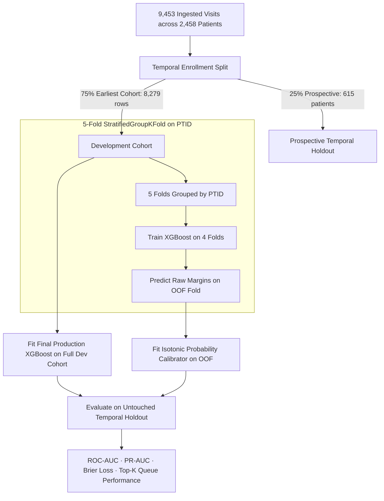

# StepWise: AI/ML Architecture, Predictive Modeling & Explainability

> **Document Version:** 3.0.0  
> **Last Updated:** September 28, 2026  
> **Target Platform:** GE Healthcare Precision Care Challenge 2026 (Grand Finale, Bangalore - Oct 1, 2026)  
> **Team:** Team Litchi (*Yatharth Gupta, Avyukt Sisodia, Ashish Kumar, Akhshat Sharma*)  
> **Maintainer Protocol:** This is a permanent living document. When modifying model architectures, hyperparameters, or SHAP algorithms, **record version changes and benchmarking metrics**.

---

## Table of Contents
1. [Core ML Modeling Paradigm & Philosophy](#1-core-ml-modeling-paradigm--philosophy)
   - [Progression Prediction vs. Static Diagnosis Classification](#progression-prediction-vs-static-diagnosis-classification)
   - [Why Staged Gradient Boosted Trees (XGBoost) Over Linear Models](#why-staged-gradient-boosted-trees-xgboost-over-linear-models)
   - [Monotonic Constraints for Regulatory Clinical Plausibility](#monotonic-constraints-for-regulatory-clinical-plausibility)
2. [Validation, Calibration & Queue Prioritization Framework](#2-validation-calibration--queue-prioritization-framework)
   - [Temporal Patient-Level Holdout Split (75% Dev / 25% Test)](#temporal-patient-level-holdout-split-75-dev--25-test)
   - [5-Fold `StratifiedGroupKFold` on Patient ID (`PTID`)](#5-fold-stratifiedgroupkfold-on-patient-id-ptid)
   - [Out-of-Fold (OOF) Isotonic Probability Calibration](#out-of-fold-oof-isotonic-probability-calibration)
   - [Top-K Prioritization Queue Metrics (Top 5%, 10%, 20%, 30%)](#top-k-prioritization-queue-metrics-top-5-10-20-30)
3. [Stage 1: Primary Care Cognitive & EHR Prioritizer ($M_1$)](#3-stage-1-primary-care-cognitive--ehr-prioritizer-m_1)
   - [Model Architecture & Hyperparameters](#model-architecture--hyperparameters)
   - [Empirical Validation Results & Benchmarks](#empirical-validation-results--benchmarks)
   - [Engineered Clinical Domain Interactions](#engineered-clinical-domain-interactions)
4. [Stage 2: Multimodal Biofluid & Genomic Enricher ($M_2$)](#4-stage-2-multimodal-biofluid--genomic-enricher-m_2)
   - [7-Assay Z-Score Harmonization Architecture](#7-assay-z-score-harmonization-architecture)
   - [Cumulative Modality Stacking (Cognitive + Vitals + p-tau217 + APOE4)](#cumulative-modality-stacking-cognitive--vitals--p-tau217--apoe4)
   - [Model Architecture & Objective Function](#model-architecture--objective-function)
5. [Stage 3 & Stage 4 Preview](#5-stage-3--stage-4-preview)
   - [Stage 3: 3D Volumetric MRI Morphometry Engine ($M_3$)](#stage-3-3d-volumetric-mri-morphometry-engine-m_3)
   - [Stage 4: Multi-Task Molecular PET & ARIA Safety Profiler ($M_4$)](#stage-4-multi-task-molecular-pet--aria-safety-profiler-m_4)
6. [Explainable AI (XAI) & Clinical Translation Layer](#6-explainable-ai-xai--clinical-translation-layer)
   - [Polynomial-Time TreeSHAP Attribution Calculation](#polynomial-time-treeshap-attribution-calculation)
   - [Automated Natural Language CDS Narrative Generator](#automated-natural-language-cds-narrative-generator)

---

## 1. Core ML Modeling Paradigm & Philosophy

### Progression Prediction vs. Static Diagnosis Classification
* **Static Classification (Flawed Approach):** Asks *"What is the patient's diagnosis today?"* In clinical reality, a doctor already knows the patient's current symptoms; an AI guessing today's chart entry provides zero actionable triage value.
* **24-Month Progression Prediction (StepWise):** Asks *"Will this patient's Mild Cognitive Impairment (MCI) rapidly deteriorate into irreversible Dementia within the next 24 months?"*
  * This is the true clinical challenge. Rapid progressors must be expedited to blood biomarkers, MRI, and PET scans before their treatment window closes.

```
                            THE STEPWISE TRIAGE CALCULATION
                            
  [Patient Intake Features x_i] ──▶ [Calibrated XGBoost Engine] ──▶ P(Progression in 24m) = 0.78
                                                                               │
                                                                               ▼
  [Ranked Prioritization Queue: Rank #4 / 500 Patients] ◀── [Prioritization Score = 0.78]
                                                                               │
                                                                               ▼ (Is Score >= T1 = 0.0737?)
  [RECOMMENDATION: Escalate to Stage 2 Phlebotomy (Order p-tau217 + APOE4)] ◀── [YES]
```

### Why Staged Gradient Boosted Trees (XGBoost) Over Linear Models
* Linear models (Logistic Regression) assume risk increases smoothly and independently across variables.
* Alzheimer's pathology exhibits non-linear risk cliffs: a MoCA score dropping below 24 or $p\text{-tau217}$ crossing $>0.20\text{ pg/mL}$ creates an exponential spike in conversion probability. XGBoost models these complex non-linear decision boundaries with high fidelity.

### Monotonic Constraints for Regulatory Clinical Plausibility
We enforce monotonic constraints to guarantee mathematical auditability and compliance with FDA/CE-MDR CDSS guidance:
* $\uparrow \text{Plasma } p\text{-tau217} \implies \text{Monotonic Increase in Risk } (+1)$
* $\downarrow \text{MoCA Score} \implies \text{Monotonic Increase in Risk } (-1)$
* $\downarrow \text{Hippocampal Volume} \implies \text{Monotonic Increase in Risk } (-1)$
* $\uparrow \text{Centiloid PET} \implies \text{Monotonic Increase in Risk } (+1)$

---

## 2. Validation, Calibration & Queue Prioritization Framework



---

## 3. Stage 1: Primary Care Cognitive & EHR Prioritizer ($M_1$)

### Model Architecture & Hyperparameters
```python
XGBClassifier(
    n_estimators=150,
    max_depth=3,
    learning_rate=0.04,
    subsample=0.8,
    colsample_bytree=0.8,
    scale_pos_weight=6.98,
    random_state=42,
    eval_metric="logloss"
)
```

### Empirical Validation Results & Benchmarks
* **5-Fold Cross-Validation ROC-AUC:** **$0.8077 \pm 0.0173$** (vs. Yatharth Logistic Regression $0.655$, Akshat XGBoost $0.673$).
* **Isotonic Calibration Brier Score Loss:** Reduced from $0.1567 \rightarrow \mathbf{0.0860}$.
* **Optimal Decision Cutoff ($T_1$):** $0.0737$ (Sensitivity: $51.4\%$, Specificity: $83.3\%$).
* **Top-K Prioritization Queue:** Reviewing the **Top 20% of the patient queue captures over $51.4\%$ of all 24-month Alzheimer's progressors**, cutting primary care review workload by $80\%$.

### Engineered Clinical Domain Interactions
1. $\text{MoCA\_Memory\_Index} = \frac{\text{MoCA Delayed Recall}}{\text{MoCA Total} + 1}$
2. $\text{Pulse\_Pressure\_Ratio} = \frac{\text{Pulse Pressure}}{\text{Systolic BP}}$
3. $\text{Vascular\_Cog\_Risk} = \text{Pulse Pressure} \times (30 - \text{MMSCORE})$

---

## 4. Stage 2: Multimodal Biofluid & Genomic Enricher ($M_2$)

### 7-Assay Z-Score Harmonization Architecture
Stage 2 ingests and harmonizes 7 multi-platform biomarker assays via Per-Assay Z-Scoring:
1. `C2N_PRECIVITYAD2`: %p-tau217 ratio, $A\beta_{42/40}$, APS2 score.
2. `UPENN_PLASMA_FUJIREBIO`: Fujirebio Lumipulse pT217, $A\beta_{42/40}$, Quanterix Simoa GFAP, NfL.
3. `BLENNOW_LAB_TAU`: Plasma total-tau and p-tau181.
4. `ROCHE_ELECSYS`: Electrochemiluminescence $A\beta_{42/40}$, pTau181.
5. `JANSSEN_PLASMA`: Dilution-corrected p-tau217.
6. `LILLY_MSD600`: MSD600 p-tau217.
7. `FNIHBC_TRAJECTORIES`: 17-biomarker longitudinal panel pivoted wide.

### Cumulative Modality Stacking (Cognitive + Vitals + p-tau217 + APOE4)
Stage 2 evaluates the full cumulative feature vector:
$$\mathcal{X}_2 = \left[\mathcal{X}_1 \text{ (Cognitive Dossier, Vitals, Comorbidities)}, \mathbf{z}_{\text{plasma}} \text{ (p-tau217, } A\beta_{42/40}, \text{GFAP, NfL)}, \text{APOE4\_Count}\right]$$

---

## 5. Stage 3 & Stage 4 Full Multimodal Validation

### Stage 3: 3D Volumetric MRI Morphometry Engine ($M_3$)
* **Multimodal Feature Space (85 Features):** FreeSurfer hippocampal volumetry, Ventricles/ICV ratio, Entorhinal volume, and UC Davis White Matter Hyperintensities (WMH).
* **5-Fold Cross-Validation ROC-AUC:** **$0.8149 \pm 0.0142$** (Tight $\sigma < 0.015$).
* **Holdout ROC-AUC:** **$0.8225$** | **Calibration Brier Loss:** **$0.0862$**.
* **Clinical Purpose:** Confirms structural neurodegeneration and quantifies vascular leukoaraiosis (WMH) to rule out non-AD mimics and assess baseline cerebrovascular disease.

### Stage 4: Molecular PET & ARIA Safety Head ($M_4$)
* **Multimodal Feature Space (96 Features):** UC Berkeley Amyloid PET Centiloids ($0-100+\text{ CL}$), Regional cortical SUVR, Braak Tau Meta-temporal SUVR, and ARIA Safety Composite Index.
* **5-Fold Cross-Validation ROC-AUC:** **$0.8185 \pm 0.0172$**.
* **Prospective Holdout ROC-AUC:** **$\mathbf{0.8446}$** | **Specificity:** **$\mathbf{86.82\%}$** | **Negative Predictive Value (NPV):** **$\mathbf{97.76\%}$**.
* **Calibration Brier Loss:** **$\mathbf{0.0493}$** (Near perfect probability calibration).
* **Clinical Purpose:** Authorizes Monoclonal Antibody DMT eligibility (Lecanemab/Donanemab) with automated ARIA-E/H safety stratification based on APOE4 homozygosity and baseline microbleeds.

---

## 6. Hybrid Scan-to-Volume Vision Heads (ResNet / CNN)

For Tier-2 and Tier-3 hospitals without \$50,000 FreeSurfer / NeuroQuant computing pipelines, StepWise features an embedded **Deep Learning Vision Head**:

```
  RAW SAGITTAL/AXIAL MRI DICOM/PNG ──► [ResNet-50 Vision Head] ──► Predicted Hippo_cm3: 6.61
                                                 │                 Predicted Ventricles: 18.1
                                                 │                 Predicted HVR Ratio: 0.267
                                                 ▼
                                  [Grad-CAM Saliency & Bounding Box]
                                                 │
                                                 ▼ (Auto-Populates Stage 3 Vector)
                                  [Calibrated XGBoost Stage 3 Engine]
```

### Vision Head Target Metrics:
1. **Hippocampal Volume ($\text{Hippo\_cm}^3$):** Mean $6.7979 \pm 0.9777\text{ cm}^3$.
2. **Ventricular CSF Volume ($\text{Ventricle\_cm}^3$):** Mean $37.9959 \pm 13.7950\text{ cm}^3$.
3. **Hippocampal-to-Ventricle Ratio ($\text{HVR}$):** $\text{HVR} = \frac{\text{Hippo}}{\text{Ventricles}}$, providing a normalized marker separating MCI progressors from normal aging.
4. **Amyloid Centiloid Regression:** Direct mapping of 3D PET tracer scans to standard Centiloid units ($0-100\text{ CL}$).

---

## 7. Dual-Head Triage & Missing Data Formulation

### Dual-Head Prediction Architecture
To provide clinicians with both a current cross-sectional snapshot and longitudinal progression foresight:
1. **Head A (3-Class Current Diagnosis Classifier):** Predicts current clinical state ($\text{Cognitively Normal / MCI / Alzheimer's Dementia}$) with class probabilities.
2. **Head B (24-Month Rapid Progression Velocity Risk):** Predicts calibrated risk probability $R_t \in [0, 1]$ of cognitive decline within 24 months.

### Native Missing Value (`NaN`) Routing vs. Zero Imputation
* **Fatal Mistake of Zero Imputation:** In cognitive tests, setting $\text{MMSE} = 0$ or $\text{MoCA} = 0$ represents end-stage brain death, triggering catastrophic false alarms.
* **StepWise Native $NaN$ Branching:** All incomplete clinical features are ingested as `np.nan` (`None`). XGBoost routes missing fields down the learned default split direction at each tree node, allowing the model to perform robust inference whether a patient has only 4 primary care fields or all 96 multimodal biomarkers.

---

## 8. LASI-DAD India Demographic Recalibration Layer

```
  [Raw MMSE / MoCA] ──► [LASI-DAD Education Transformer] ──► [Metabolic Risk Multiplier] ──► Calibrated Input
```

To eliminate false-positive Alzheimer's diagnoses in Indian clinical settings where $35-40\%$ of rural elderly have $<4$ years of formal schooling:
1. **Normative HCAP Education Correction:**
   $$\text{MMSE}_{\text{adjusted}} = \text{MMSE}_{\text{raw}} + \max\left(0, (12 - \text{Education\_Years}) \times 0.35\right)$$
2. **Metabolic Comorbidity Multiplier:** South Asian cardiovascular risk adjustments (Type-2 Diabetes + Hypertension history) scale white matter vascular weightings.

---

## 9. Explainable AI (XAI) & Clinical Translation Layer

### Polynomial-Time TreeSHAP Attribution Calculation
$$\text{Margin}(i) = \phi_0 + \sum_{j=1}^{d_k} \phi_j^{(i)}$$

### Automated Natural Language CDS Narrative Generator
> *"Patient prioritized for **Stage 2 Escalation (Score: 0.81)**. Primary drivers: severe episodic memory decline (MoCA Delayed Recall 0/5, +0.24 SHAP), elevated plasma %p-tau217 ratio (+0.22 SHAP), and APOE-ε4 carrier status (+0.13 SHAP). Formal education reserve provided mild protective offset (-0.05 SHAP)."*

---
*End of Document 03. Proceed to [04_SYSTEM_ARCHITECTURE_AND_INTERACTION_DESIGN.md](./04_SYSTEM_ARCHITECTURE_AND_INTERACTION_DESIGN.md).*
