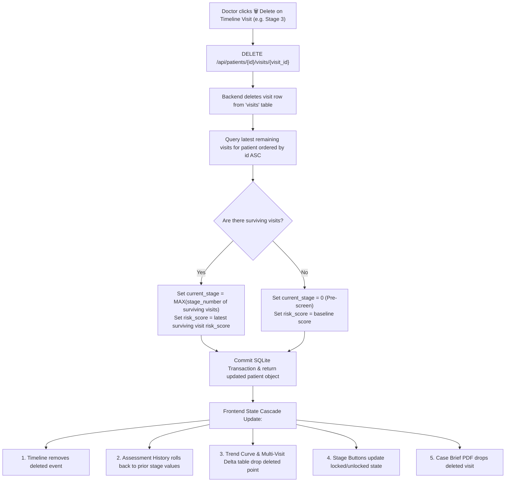

# StepWise PRO — Master Architectural & UI/DB Overhaul Plan

> **Author:** StepWise PRO Core Development Team  
> **Target:** GE Healthcare Precision Care Challenge 2026  
> **Status:** Active Execution Roadmap & Living Specification Document  
> **Location:** Local Root (`STEPWISE_OVERHAUL_PLAN.md`)

---

## 1. Executive Summary & Core Philosophy

This specification is the authoritative, living blueprint for the complete architectural, database, and user interface overhaul of **StepWise PRO**. The system bridges multimodal machine learning (XGBoost progression predictors, multi-task PyTorch vision CNNs, and GAAIN Centiloid backpropagation) with a physician-grade user interface inspired by the GE Healthcare Precision Care challenge requirements.

### 1.1 Core Architectural Principles
- **No Cluttered Direct Page Inputs**: We do **not** clutter the main stage workup page with permanent inline checkboxes and raw input fields.
- **2-Step Workup Protocol (HTML Form Modal $\rightarrow$ Bento Grid Dashboard)**:
  1. Clicking an active/unlocked stage button opens a dedicated **Clinical Data Ingest Form Modal**.
  2. The form features checkboxes for test selection, dynamic input fields for checked items, mock data presets (`Healthy CN`, `Mild MCI`, `Advanced AD`), and an assessment date picker.
  3. Clicking "Commit Workup & Run Inference" submits data to FastAPI, executes AI inference, and transitions to the **Stage Bento Grid Interface**.
- **Stage Bento Dashboard**: Displays submitted metrics in structured **Bento Grids (2-column rows)** with color-coded severity badges (**Green** = Normal, **Amber** = Borderline/MCI, **Red** = High Risk/Pathology), AI dual-head classification, SHAP feature bars, PyTorch Grad-CAM viewers (Stages 3/4), and the Doctor-in-the-Loop decision gate.
- **Automatic LASI-DAD Normative Calibration**: Configured at the patient level, automatically applied in the backend to Stage 1 and Stage 2 models, and displayed as a clean static `[ LASI-DAD Active ]` badge in the stage header.
- **Visual Stage State Indicators**: Completed stages in solid blue, currently active/open stage in **amber/yellow** (`ACTIVE / PENDING WORKUP`), and future stages locked.
- **Strict Cascading Database Coherence**: Every action (ingest, escalation, revisit, edit, delete) is synchronized across the SQLite database, patient timeline, multi-visit delta comparison table, trend curves, assessment history cards, and printable PDF briefs.

---

## 2. Global Navigation & Stage Access Controls

### 2.1 Sidebar Navigation Reset
- **Problem**: When viewing a patient dossier or nested stage, clicking the sidebar "Patients" button does not navigate back to the cohort registry.
- **Specification**: Set `onClick` on the Sidebar `Patients` nav item to unconditionally reset `selectedPatientId = null` and `patientView = 'dossier'`, instantly returning the physician to the Patient Registry from any nested screen.
- **Status**: `[x]` Configured in top-level view router.

### 2.2 Strict Sequential Stage Gating & Locking
- **Progression Sequence**: **Stage 1 (Cognitive) $\rightarrow$ Stage 2 (Biomarkers) $\rightarrow$ Stage 3 (MRI) $\rightarrow$ Stage 4 (PET)**.
- **Visual States on Patient Dossier**:
  - **Completed Stage**: Solid Blue / Dark Blue with recorded score summary.
  - **Active / Unlocked Stage (Pending Assessment)**: **Amber / Yellow accent border & badge** (`ACTIVE / PENDING WORKUP`), visually highlighting where the patient is currently waiting.
  - **Locked Stages**: Subtle dashed border with `LOCKED` badge.
- **Gating Barrier Dialog**: Clicking a locked stage button triggers an informative clinical barrier modal explaining that prior stage gating thresholds must be completed and authorized by the attending physician before unlocking subsequent workups.
- **Status**: `[ ]` To be finalized in stage button strip.

---

## 3. Patient Dossier (Dashboard) Architecture: Exact 2-Column Layout

```
┌────────────────────────────────────────────────────────────────────────────────────────────────────────────────────────┐
│  ← Back to Cohort Registry                                                                                             │
├──────────────────────────────────────────────────────────────┬─────────────────────────────────────────────────────────┤
│  LEFT COLUMN (Clinical Command & Longitudinal Data)          │  RIGHT COLUMN (Timeline Audit & Current Status)         │
│                                                              │                                                         │
│  ┌─────────────────────────────────────────────────────────┐ │  ┌────────────────────────────────────────────────────┐ │
│  │ 1. PATIENT PROFILE & CLINICAL BASELINES BOX             │ │  │ 1. PATIENT TIMELINE & AUDIT LOG                   │ │
│  │    Name, MRN, Age, Gender, Primary Doctor, Bay Location │ │  │    Vertical date-ordered chronological audit log: │ │
│  │    [ Edit Profile ]   [ LASI-DAD Bias ]                 │ │  │    ● Stage 2 Escalation (2026-09-30)              │ │
│  │    ┌──────────────────────────────────────────────────┐ │ │  │      Dr. Kenneth · [🗑️ Delete] [✏️ Inspect/Edit]    │ │
│  │    │ Sub-Box: Vitals & Active Comorbidities           │ │ │  │    ● Stage 1 Screened (2025-09-15)                │ │
│  │    │ BP: 128/82 | Pulse: 74 bpm | BMI: 25.4           │ │ │  │      MoCA: 16/30 · [🗑️ Delete] [✏️ Inspect/Edit]    │ │
│  │    │ [Hypertension] [T2D] [Hyperlipidemia] [APOE ε4]  │ │ │  │    ● Patient Enrolled (2024-09-12)                │ │
│  │    └──────────────────────────────────────────────────┘ │ │  └────────────────────────────────────────────────────┘ │
│  └─────────────────────────────────────────────────────────┘ │                                                         │
│                                                              │  ┌────────────────────────────────────────────────────┐ │
│  ┌─────────────────────────────────────────────────────────┐ │  │ 2. CURRENT ASSESSMENT HISTORY (Bento Card)       │ │
│  │ 2. 4 STAGE BUTTONS STRIP + NEW REVISIT                  │ │  │    Most recent status across all stages:           │ │
│  │    [ Stage 1: Cog (Done) ] [ Stage 2: Bio (Active-Amber)│ │  │    • Stage 1 (2026-09-15): MoCA 16/30 [HIGH RISK]  │ │
│  │    [ Stage 3: MRI (Lock) ] [ Stage 4: PET (Lock) ]      │ │  │    • Stage 2 (2026-09-30): p-tau 0.42 pg/mL [HIGH] │ │
│  │    [+ New Revisit Action Button]                        │ │  │    • Stage 3: Hippo 3.15 cm³ [MODERATE ATROPHY]    │ │
│  │    *Sequential lock enforced on stages > current_stage  │ │  │    • Stage 4: Centiloids 78.4 CL [AMYLOID POSITIVE]│ │
│  └─────────────────────────────────────────────────────────┘ │  │    *Clean visual snapshot (Red/Amber/Green badges) │ │
│                                                              │  └────────────────────────────────────────────────────┘ │
│  ┌─────────────────────────────────────────────────────────┐ │                                                         │
│  │ 3. LONGITUDINAL PROGRESSION & MULTI-VISIT DELTAS        │ │                                                         │
│  │    Tabs: [ Trends (Bezier Curve) ]  [ Multi-Visit (Δ) ] │ │                                                         │
│  │    • Trends: Interactive M00 → M12 → M24 Risk Curve     │ │                                                         │
│  │    • Deltas: Full comparative matrix across all visits: │ │                                                         │
│  │      Date | MMSE | MoCA | p-tau | Hippo | Cent | Risk Δ │ │                                                         │
│  └─────────────────────────────────────────────────────────┘ │                                                         │
│                                                              │                                                         │
│  ┌─────────────────────────────────────────────────────────┐ │                                                         │
│  │ 4. OFFICIAL CASE BRIEF PDF REPORT ACTION                │ │                                                         │
│  │    [ Download / Print Comprehensive Case Brief PDF ]    │ │                                                         │
│  │    Multi-page publication-grade PDF containing all data,│ │                                                         │
│  │    longitudinal deltas, LASI-DAD bias, and doctor notes │ │                                                         │
│  └─────────────────────────────────────────────────────────┘ │                                                         │
└──────────────────────────────────────────────────────────────┴─────────────────────────────────────────────────────────┘
```

### 3.1 Left Column Components (Top to Bottom)
1. **Patient Profile & Clinical Baselines Box (Big Card)**:
   - **Header**: Patient Full Name, MRN (`#GE-ADNI-4048`), Demographics (`65y · Male`), Attending Physician (`Dr. Kenneth Adams, MD`), Location (`Precision Neuro Center, Bay 3`).
   - **Action Buttons (Top-Right)**:
     - `[ Edit Profile ]`: Modifies demographics, doctor, location, and clinical notes.
     - `[ LASI-DAD Bias ]`: Adjusts Indian population normative calibration parameters.
   - **Sub-Box (Vitals & Comorbidities)**:
     - Vitals display: Blood Pressure (`128/82 mmHg`), Pulse (`74 bpm`), BMI (`25.4 kg/m²`).
     - Active Comorbidities: *Hypertension*, *Type-2 Diabetes*, *Hyperlipidemia*, *CAD*, *Stroke*, *Sleep Apnea*, *APOE Genotype ($\varepsilon4/\varepsilon4$)*.
2. **4 Stage Action Buttons Strip + New Revisit**:
   - Four solid buttons with dynamic color state:
     - Completed stages in solid blue.
     - Unlocked pending stage in **amber/yellow** (`ACTIVE / PENDING WORKUP`).
     - Subsequent stages locked.
   - `[ + New Revisit ]` button: Opens Revisit Modal to log revisit date/reason and start a fresh Stage 1 cycle.
3. **Longitudinal Risk Trajectory & Multi-Visit Delta Table**:
   - Header Toggle: **`[ Trends ]`** vs. **`[ Multi-Visit Deltas (Δ) ]`**.
   - **Trends View**: Responsive SVG smooth Bezier curve plotting calibrated progression risk ($0.0$ to $1.0$) across visit milestones (`M00`, `M12`, `M24`). Color-coded node badges: Green ($<40\%$), Amber ($40-69\%$), Red ($\ge70\%$).
   - **Multi-Visit Deltas (Δ) View**: High-density clinical table comparing: Visit Code & Date, Cognitive (MMSE, MoCA, CDR-SB), Blood (p-tau217, Aβ42/40, NfL), MRI (Hippo $cm^3$, Ventricles $cm^3$), PET (Centiloids, Tau SUVR), Risk %, Velocity, and Doctor Notes.
4. **Case Brief PDF Action**:
   - Prominent button launching the multi-page printable PDF report modal.

### 3.2 Right Column Components (Top to Bottom)
1. **Patient Timeline & Audit Log**:
   - Chronological vertical timeline ordered by exact dates (`2024-09-12` $\rightarrow$ `2025-09-15` $\rightarrow$ `2026-09-30`).
   - Milestones: *Patient Enrolled*, *Stage 1 Screened*, *Stage 2 Escalated*, *Stage 3 MRI Evaluated*, *Stage 4 Completed*, *Revisits*.
   - **Interactive Event Actions**:
     - **Delete Button (`Trash2` icon)**: Deletes that visit from SQLite and triggers automatic state rollback.
     - **Inspect / Edit Action**: Opens a pop-up showing the exact data recorded on that date for review, copying, or in-line editing.
2. **Current Assessment History (Bento Status Card)**:
   - Displays the **most recent, current clinical status** across all stages:
     - **Stage 1**: MoCA / MMSE score with severity badge (`MoCA 16/30 · HIGH RISK`).
     - **Stage 2**: Plasma p-tau217 & Aβ42/40 ratio (`p-tau 0.42 pg/mL · ELEVATED`).
     - **Stage 3**: Hippocampal volume (`3.15 cm³ · MTA Grade 2`).
     - **Stage 4**: GAAIN Centiloids (`78.4 CL · Amyloid Positive`).
   - Clean display with accent badges (Red, Amber, Green) acting as an immediate status reference for the attending physician.

---

## 4. Timeline Deletion & Cascade Database Rollback Engine



### 4.1 Deletion & Rollback Guarantees
- When a visit/stage is deleted from the timeline:
  - **Database**: The specific visit row is purged from `visits`.
  - **Stage Rollback**: `patients.current_stage` is set to the maximum `stage_number` among remaining visits (or 0 if none remain).
  - **Risk Score Rollback**: `patients.risk_score` reverts to the risk score of the latest surviving visit.
  - **Assessment History**: Immediately reflects the previous stage metrics without ghost data.
  - **Multi-Visit Deltas & Trends**: Instantly re-renders without the deleted point.
  - **Stage Buttons**: Stages that were unlocked solely by the deleted visit automatically re-lock.

---

## 5. The 2-Step Stage Workup Protocol

```
┌────────────────────────────────────────────────────────────────────────────────────────────────────────────────────────┐
│  ← Back to Dossier                                                                                                     │
│  STAGE [N]: [STAGE NAME]                     [📅 Assessment Date: 2026-09-30]   [🌐 LASI-DAD Active (Stages 1 & 2)]    │
├──────────────────────────────────────────────────────────────┬─────────────────────────────────────────────────────────┤
│  LEFT COLUMN: CLINICAL METRICS BENTO GRIDS (2-Col Sub-grid)  │  RIGHT COLUMN: AI ML ANALYSIS & SHAP EXPLAINABILITY     │
│                                                              │                                                         │
│  ┌────────────────────────────┬────────────────────────────┐ │  ┌────────────────────────────────────────────────────┐ │
│  │ BENTO CARD 1               │ BENTO CARD 2               │ │  │ 1. AI ML PROGRESSION & DIAGNOSTIC CLASSIFIER       │ │
│  │ MoCA Total: 16/30 [HIGH]   │ MMSE Total: 18/30 [HIGH]   │ │  │    • 24-Month Calibrated Progression Risk: 78.4%   │ │
│  │ Visuospatial: 2/5          │ Orientation: 6/10          │ │  │    • Dual-Head Diagnosis: MCI (Mild Cognitive Imp) │ │
│  │ Delayed Recall: 1/5        │ Recall: 1/3                │ │  │    • Velocity: High Rapid Converter                │ │
│  │ Normative: <26 cut-off     │ Normative: <24 cut-off     │ │  └────────────────────────────────────────────────────┘ │
│  ├────────────────────────────┼────────────────────────────┤ │                                                         │
│  │ BENTO CARD 3               │ BENTO CARD 4               │ │  ┌────────────────────────────────────────────────────┐ │
│  │ CDR-SB: 4.5 pts [MODERATE] │ FAQ Total: 12/30 [FLAGGED] │ │  │ 2. XGBOOST SHAP FEATURE ATTRIBUTION DRIVERS        │ │
│  │ Sum of 6 functional domains│ Functional Activities      │ │  │    Visual explainability bars:                     │ │
│  │ Cut-off: >1.0 indicates MCI│ Daily living impairment    │ │  │    • MoCA Score (16/30)          [████████] +0.28  │ │
│  └────────────────────────────┴────────────────────────────┘ │  │    • Plasma p-tau217 (0.42 pg/mL)[██████  ] +0.22  │ │
│                                                              │  │    • Hippocampal Volume (3.15 cm³)[████   ] +0.16  │ │
│  (For Stage 3 MRI & Stage 4 PET only):                       │  │    • Education Tier (14y)        [██      ] -0.08  │ │
│  ┌─────────────────────────────────────────────────────────┐ │  └────────────────────────────────────────────────────┘ │
│  │ PYTORCH NEURAL VISION GRAD-CAM HUB                      │ │                                                         │
│  │ Ingest DICOM (.dcm), Volume (.zip), or (.png)           │ │  ┌────────────────────────────────────────────────────┐ │
│  │ [Side-by-Side Mode]   [Grad-CAM Pixel Overlay Mode]     │ │  │ 3. ACTIVE COMORBIDITIES (Context Box)              │ │
│  │ [Upload Scan]         [Re-run Neural Grad-CAM]          │ │  │    [Hypertension] [T2D] [Hyperlipidemia] [APOE ε4] │ │
│  │ Live Parenchyma Heatmap + Auto-Extracted Parameters     │ │  └────────────────────────────────────────────────────┘ │
│  └─────────────────────────────────────────────────────────┘ │                                                         │
├──────────────────────────────────────────────────────────────┴─────────────────────────────────────────────────────────┤
│  FULL-WIDTH BOTTOM SECTION: DOCTOR-IN-THE-LOOP CLINICAL DECISION GATE                                                  │
│  ┌───────────────────────────────────────────────────────────────────────────────────────────────────────────────────┐ │
│  │ 1. [ Escalate to Stage N+1 ]     2. [ Return to Routine Care ]     3. [ Collect More Data (Same Stage) ]          │ │
│  │                                                                                                                   │ │
│  │ Physician Clinical Notes & Gating Rationale (Stage N):                                                            │ │
│  │ [ Clinical observations, diagnostic rationale, treatment plan, justification for referral...                    ] │ │
│  │                                                                                                                   │ │
│  │ [ 🛡️ Confirm Clinical Decision & Save Assessment ]                                                                 │ │
│  └───────────────────────────────────────────────────────────────────────────────────────────────────────────────────┘ │
└────────────────────────────────────────────────────────────────────────────────────────────────────────────────────────┘
```

---

## 6. Detailed Stage Specifications

### 6.1 Stage 1: Cognitive Screening
- **Header**: `Stage 1: Cognitive Screening`, Assessment Date Picker, static `[ LASI-DAD Active ]` badge.
- **HTML Workup Form Modal (Ingest Phase)**:
  - **Checklist**: MMSE ($\checkmark$), MoCA ($\checkmark$), CDR-SB ($\checkmark$), FAQ ($\checkmark$), ADAS-Cog13 ($\checkmark$), GDS-15 ($\checkmark$).
  - **Inputs**:
    - MMSE Total Score (0–30) + Orientation, Registration, Recall sub-scores.
    - MoCA Total Score (0–30) + Visuospatial, Executive, Delayed Recall.
    - CDR-SB (0–18 pts, Clinical Dementia Rating Sum of Boxes).
    - FAQ Total (0–30 pts, Functional Activities Questionnaire).
    - ADAS-Cog13 Total (0–85 pts).
    - GDS-15 (0–15 pts, Geriatric Depression Scale).
  - **Mock Data Presets**:
    - *Healthy (CN)*: MMSE 29, MoCA 28, CDR-SB 0.0, FAQ 0, ADAS 9, GDS 1.
    - *Mild (MCI)*: MMSE 24, MoCA 21, CDR-SB 1.5, FAQ 5, ADAS 24, GDS 2.
    - *Advanced (AD)*: MMSE 17, MoCA 15, CDR-SB 5.0, FAQ 14, ADAS 39, GDS 4.
- **Stage Bento Interface (Post-Submission)**:
  - **Left Column (2-Col Bento Grid)**:
    - **Card 1 (MoCA Total & Sub-scores)**: Score with severity badge (`Normal ≥26`, `MCI 18–25`, `Severe <18`).
    - **Card 2 (MMSE Total & Sub-scores)**: Score with normative cutoff badge.
    - **Card 3 (CDR-SB Functional Index)**: Sum of 6 functional domains.
    - **Card 4 (FAQ & ADAS-Cog13 / GDS)**: Daily living & depression indices.
  - **Right Column (AI Analysis & SHAP)**:
    - AI Calibrated Progression Risk % (24-month horizon) + Dual-Head Diagnosis.
    - XGBoost SHAP attribution drivers (positive risk contributors in red, protective in green).
    - Active comorbidities summary box.
  - **Bottom Full-Width Section**:
    - Doctor-in-the-Loop decision gate (3 options: Escalate to Stage 2 / Routine Care / More Data) + Doctor Clinical Notes + Confirm & Save button.

---

### 6.2 Stage 2: Blood Biomarker Panel (Plasma Proteomics)
- **Header**: `Stage 2: Blood Biomarker Panel`, Assessment Date Picker, static `[ LASI-DAD Active ]` badge.
- **HTML Workup Form Modal (Ingest Phase)**:
  - **Checklist**: Plasma p-tau217 ($\checkmark$), Plasma Aβ42/Aβ40 Ratio ($\checkmark$), Plasma NfL ($\checkmark$), Plasma GFAP ($\checkmark$).
  - **Inputs**:
    - Plasma p-tau217 (pg/mL, cutoff $>0.20$ pg/mL).
    - Plasma Aβ42/Aβ40 Ratio (ratio, cutoff $<0.089$).
    - Plasma NfL (pg/mL, cutoff $>15.0$ pg/mL).
    - Plasma GFAP (pg/mL, cutoff $>180.0$ pg/mL).
  - **Mock Data Presets**:
    - *Healthy (CN)*: p-tau 0.08 pg/mL, Aβ42/40 0.115, NfL 9.2 pg/mL, GFAP 88.0 pg/mL.
    - *Mild (MCI)*: p-tau 0.24 pg/mL, Aβ42/40 0.082, NfL 15.4 pg/mL, GFAP 195.0 pg/mL.
    - *Advanced (AD)*: p-tau 0.45 pg/mL, Aβ42/40 0.062, NfL 26.5 pg/mL, GFAP 320.0 pg/mL.
- **Stage Bento Interface (Post-Submission)**:
  - **Left Column (2-Col Bento Grid)**:
    - **Card 1 (Plasma p-tau217)**: Simoa HD-X assay score with $>0.20$ pg/mL amyloid pathology badge.
    - **Card 2 (Plasma Aβ42/Aβ40 Ratio)**: Amyloid cascading ratio with $<0.089$ cutoff badge.
    - **Card 3 (Plasma NfL)**: Neuroaxonal injury marker ($>15$ pg/mL).
    - **Card 4 (Plasma GFAP)**: Reactive astrogliosis marker ($>180$ pg/mL).
  - **Right Column (AI Analysis & SHAP)**:
    - Multimodal Calibrated Risk %, Dual-Head Diagnosis, SHAP feature bars (`p-tau217 +0.28`).
    - Active comorbidities box.
  - **Bottom Full-Width Section**:
    - Doctor-in-the-Loop decision gate (Escalate to Stage 3 / Routine Care / More Data) + Doctor Notes + Confirm & Save button.

---

### 6.3 Stage 3: Volumetric MRI Morphometry
- **Header**: `Stage 3: Volumetric MRI Morphometry`, Assessment Date Picker.
- **HTML Workup Form Modal (Ingest Phase)**:
  - **Checklist & Direct Inputs**: Hippocampal Volume ($\checkmark$), Lateral Ventricles ($\checkmark$), Hippo/ICV Ratio ($\checkmark$), WMH Volume ($\checkmark$).
  - **DICOM / Neural Ingest**: File uploader accepting `.dcm`, `.ima`, `.zip`, `.png`, `.jpg` to auto-extract parameters via PyTorch.
  - **Mock Data Presets**:
    - *Healthy (CN)*: Hippo 4.20 cm³, Ventricles 28.0 cm³, Ratio 0.0031, WMH 0.8 cm³ (MTA 0).
    - *Mild (MCI)*: Hippo 3.45 cm³, Ventricles 44.0 cm³, Ratio 0.0024, WMH 2.5 cm³ (MTA 2).
    - *Advanced (AD)*: Hippo 2.70 cm³, Ventricles 58.5 cm³, Ratio 0.0018, WMH 5.2 cm³ (MTA 3).
- **Stage Bento Interface (Post-Submission)**:
  - **Left Column (2-Col Bento Grid & Grad-CAM Hub)**:
    - **Card 1 (Hippocampal Volumetrics)**: Volume ($cm^3$) + age-adjusted percentile (`12th %ile Moderate Atrophy`).
    - **Card 2 (Lateral Ventricles & Ratio)**: Ventricular dilation (+2.8 SD) & WMH Fazekas load.
    - **PyTorch Neural Grad-CAM Hub**: ResNet-18 vision viewer with `Side-by-Side` and `Grad-CAM Pixel Overlay` modes (saliency-only mode removed).
  - **Right Column (AI Analysis & SHAP)**:
    - Calibrated Progression Risk %, Dual-Head Classification, SHAP feature bars (`Hippo vol -0.18`).
    - Active comorbidities box.
  - **Bottom Full-Width Section**:
    - Doctor-in-the-Loop decision gate (Escalate to Stage 4 / Routine Care / More Data) + Doctor Notes + Confirm & Save button.

---

### 6.4 Stage 4: Molecular Amyloid PET Quantitation
- **Header**: `Stage 4: Molecular Amyloid PET Quantitation`, Assessment Date Picker.
- **HTML Workup Form Modal (Ingest Phase)**:
  - **Checklist & Direct Inputs**: Centiloid Amyloid Load ($\checkmark$), Meta-Temporal Tau SUVR ($\checkmark$), ARIA-H Microbleeds ($\checkmark$).
  - **DICOM / PET Ingest**: File uploader for Amyloid / Tau tracer scans.
  - **Mock Data Presets**:
    - *Healthy (CN)*: Centiloids 8.0 CL, Tau SUVR 1.05, Microbleeds 0.
    - *Mild (MCI)*: Centiloids 62.0 CL, Tau SUVR 1.42, Microbleeds 0.
    - *Advanced (AD)*: Centiloids 98.5 CL, Tau SUVR 1.88, Microbleeds 2.
- **Stage Bento Interface (Post-Submission)**:
  - **Left Column (2-Col Bento Grid & Centiloid Hub)**:
    - **Card 1 (GAAIN Centiloid Score)**: Centiloid load (`78.4 CL - Amyloid Positive`).
    - **Card 2 (Meta-Temporal Tau SUVR)**: Braak Stage tracer uptake ratio (`1.48 - Limbic Transition`).
    - **Card 3 (ARIA-H Safety Prescreening)**: Microbleed count for mAb therapy safety.
    - **PyTorch DenseNet-121 Centiloid Hub**: GAAIN Standardized cortical tracer mapping.
  - **Right Column (AI Analysis & SHAP)**:
    - Final Comprehensive Calibrated Progression Risk %, Dual-Head Classification, SHAP feature bars.
    - Active comorbidities box.
  - **Bottom Full-Width Section**:
    - Doctor-in-the-Loop decision gate (Complete Protocol / Routine Care / More Data) + Doctor Notes + Confirm & Save button.

---

## 7. Database Schema & Multi-Visit 50-Patient Seeding

### 7.1 Database Table Definitions (`backend/data/stepwise.db`)
```sql
CREATE TABLE IF NOT EXISTS patients (
    id TEXT PRIMARY KEY,
    mrn TEXT UNIQUE,
    name TEXT NOT NULL,
    age INTEGER NOT NULL,
    gender TEXT NOT NULL,
    dob TEXT,
    education_years INTEGER DEFAULT 14,
    apoe TEXT DEFAULT 'ε3/ε3',
    referral TEXT DEFAULT 'Memory Disorders Clinic',
    patient_notes TEXT DEFAULT '',
    primary_doctor TEXT DEFAULT 'Dr. Kenneth Adams, MD',
    clinic_location TEXT DEFAULT 'Precision Neuro Center, Bay 3',
    current_stage INTEGER DEFAULT 0,
    risk_score REAL DEFAULT 0.35,
    velocity TEXT DEFAULT 'Moderate',
    vitals_json TEXT DEFAULT '{}',
    medical_history_json TEXT DEFAULT '{}',
    lasidad_calibration_json TEXT DEFAULT '{}',
    created_at TEXT DEFAULT CURRENT_TIMESTAMP,
    updated_at TEXT DEFAULT CURRENT_TIMESTAMP
);

CREATE TABLE IF NOT EXISTS visits (
    id INTEGER PRIMARY KEY AUTOINCREMENT,
    patient_id TEXT NOT NULL,
    visit_code TEXT NOT NULL,
    visit_date TEXT NOT NULL,
    stage_number INTEGER DEFAULT 1,
    mmse REAL, moca REAL, cdrsb REAL, faq REAL, adas13 REAL, gds REAL,
    ptau217 REAL, ab42_40 REAL, nfl REAL, gfap REAL,
    hippocampus_cm3 REAL, ventricles_cm3 REAL, mta_grade TEXT,
    centiloids REAL, tau_suvr REAL, microbleeds INTEGER DEFAULT 0,
    risk_score REAL, stage_dx TEXT,
    stage_assessment_json TEXT DEFAULT '{}',
    doctor_notes TEXT DEFAULT '',
    escalation_decision TEXT DEFAULT '',
    created_at TEXT DEFAULT CURRENT_TIMESTAMP,
    FOREIGN KEY (patient_id) REFERENCES patients(id)
);
```

### 7.2 Seeding Plan for All 50 Patients
- Populate all 50 ADNI patients with:
  - Realistic multi-visit dates (`M00: 2024-09-12`, `M12: 2025-09-15`, `M24: 2026-09-30`).
  - Stage-appropriate metrics across Stages 1, 2, 3, and 4.
  - Comprehensive comorbidities (`hypertension`, `diabetes`, `hyperlipidemia`, `cad`, `stroke`, `sleep_apnea`).
  - Complete vitals (`bp`: '126/80 mmHg', `pulse`: 72, `bmi`: 25.4).

---

## 8. Printable Case Brief PDF Specification

The Case Brief PDF report layout includes:
1. **Header**: Hospital & GE Healthcare Precision CDS branding, Patient MRN, Case ID, Report Date.
2. **Patient Demographics**: Age, Gender, APOE genotype ($\varepsilon4/\varepsilon4$), Education, Primary Physician, Clinic Location.
3. **Multi-Stage Biomarker Summary Table**:
   - Stage 1: MoCA, MMSE, CDR-SB, FAQ, ADAS-13.
   - Stage 2: Plasma p-tau217, Aβ42/40, NfL, GFAP.
   - Stage 3: Hippocampal Volume ($cm^3$), Lateral Ventricles, MTA Grade.
   - Stage 4: Centiloids (CL), Tau SUVR, ARIA Microbleeds.
4. **Longitudinal Trajectory Table**: Multi-visit progression metrics ($M00 \rightarrow M12 \rightarrow M24$).
5. **LASI-DAD Normative Adjustments**: Education cutoffs, language adjustments, rural SES factors.
6. **AI Explainability & SHAP Drivers**: Top positive and protective feature attributions.
7. **Doctor Clinical Notes & Decision Sign-Off**: Attending doctor's clinical rationale and digital signature block.

---

## 9. Analytics View & Hospital ROI Hub

- **Cohort KPI Cards**: Total Encountered (1,204), Screened (894), Escalated (128), Monitored (182), Concordance (94.2%).
- **Cascade Stage Distribution**: Horizontal segmented bar ($S1: 45\% \rightarrow S2: 30\% \rightarrow S3: 18\% \rightarrow S4: 7\%$).
- **Age Cohort Distribution**: Clean bar chart (50-59, 60-69, 70-79, 80-89, 90+).
- **Hospital ROI Simulator**: Real-time slider simulator calculating annual financial savings from avoided PET scans.

---

## 10. Living Implementation Checklist

- [x] **Task 1: Database Seeding & Cascade Rollback Engine**
  - [x] Execute 50-patient multi-visit seeding script with realistic longitudinal dates.
  - [x] Implement and verify atomic cascade rollback on visit deletion.
- [x] **Task 2: Patient Dossier (Dashboard) UI Overhaul**
  - [x] Restructure Patient Dossier into the exact 2-column layout.
  - [x] Build Patient Profile & Baseline Vitals/Comorbidities card.
  - [x] Build 4-Stage Action Buttons Strip with sequential locking & amber pending state.
  - [x] Build Longitudinal Progression Trajectory (Trends Bezier & Multi-Visit Delta Table).
  - [x] Connect Timeline Delete (`Trash2`) and Inspect/Edit modal.
  - [x] Build Current Assessment History Bento Card on right column.
- [x] **Task 3: 2-Step Stage Workup Protocol (HTML Form Modal $\rightarrow$ Bento Grid)**
  - [x] Create Stage 1–4 HTML Workup Form Modals with checkboxes & mock presets.
  - [x] Build post-submission Stage Bento Grid interfaces (2-col sub-grids with color-coded badges).
  - [x] Integrate PyTorch Grad-CAM Neural Vision Hub for Stages 3 & 4 (Side-by-side & overlay modes).
  - [x] Connect Doctor-in-the-Loop Decision Gate & Notes persistence.
- [x] **Task 4: Printable Case Brief PDF Report**
  - [x] Implement publication-grade multi-page Case Brief PDF modal layout.
- [x] **Task 5: Analytics View Redesign**
  - [x] Restyle Analytics dashboard to match reference UI tokens and ROI simulator.
- [x] **Task 6: Verification & Production Compilation**
  - [x] Test end-to-end user workflows, compile Next.js production build, and verify server health.
